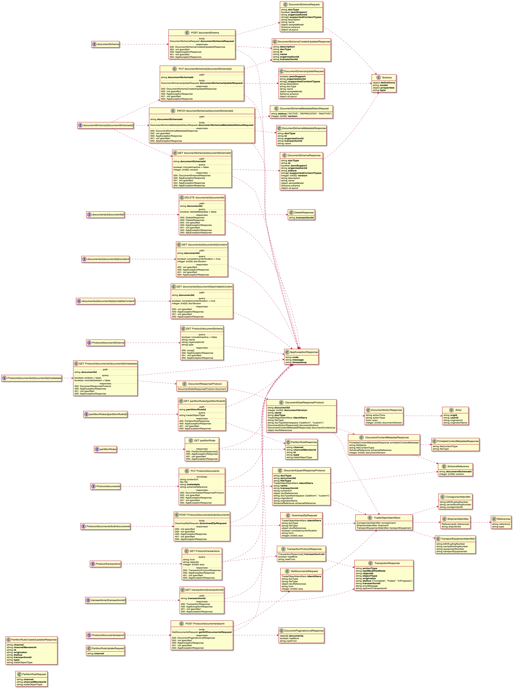

# Freight Trust Network

- [Freight Trust Network](#freight-trust-network)
- [Abstract](#abstract)
  - [Network Overview](#network-overview)
  - [EDI Messages](#edi-messages)
  - [Nodes](#nodes)
    - [Network Nodes](#network-nodes)
    - [Concensus Nodes](#concensus-nodes)
  - [EDI Transactions](#edi-transactions)
    - [Transaction Sets](#transaction-sets)
    - [Loops](#loops)
    - [Parsing](#parsing)
    - [Example EDI](#example-edi)
  - [Protocol](#protocol)
  - [Burgess](#burgess)
    - [Unit Concepts](#unit-concepts)
  - [Blocks as `units of agreement`](#blocks-as--units-of-agreement-)
    - [Facts](#facts)
    - [Rules](#rules)
  - [Rulebook](#rulebook)
  - [Further Documentation](#further-documentation)
  - [License](#license)

# Abstract

Business A and Business B have a `transaction`, in this example the transaction
is a shippment of freight. This diagram shows at a high level how we facilitate
these business `transactions` in a distributed, fault tolerant network utilziing
hyperledger besu. Censorship resistance and high availability are some of the
more important aspects of utilizing a blockchain network, in addition to
providing for a provably electronically unique piece of data (i.e. this is why
cryptocurrencies work in the first place).


## Network Overview


## EDI Messages

> Note EDI Messages are NOT $EDI Tokens. $EDI Tokens represent the unit of
> account for Units of Agreement and Units of Execution (i.e. think of it just
> as you would think of gwei for ethereum, a fixed unit of cost per byte for
> transacting on the network.)

Charging on a `per byte` basis has been and continutes to be the basis of all
transactional cost models especially EDI and XML messages which provide an
incentive for users not to spam the network with unnecessarily large messages.


## Nodes

There are 5 different classes of nodes, with 2 groups.

- Network Nodes
- Concensus Nodes

### Network Nodes


Besu-tx: Handling of local transaction pool.

Besu-sync: Handling of blockchain synchronisation through Ethereum P2P network.

Besu-query: Handling of database queries.


### Concensus Nodes

Sealer

In general concept terms, a Sealer adds its testimony (assertion of
authentication assessment) and proof of custody to the chain of custody.

Validator

In general concept terms, a Validator inspects the chain of custody to determine
the content and validity of individual evidence supplied by custodians.

## EDI Transactions

ASC X12 standards define commonly used EDI transactions. The standards define a
structure/format for exchange of EDI data.

### Transaction Sets

Each transaction type is called a "transaction set". The smallest data item in a
transaction is called an "element". Groups of related elements form a data
segment. A data element separator separates the elements within a segment. A
segment starts with a element which is called the segment ID, and ends with a
segment terminator.

### Loops

Logical groups of segments are called loops. There are some segments, which are
used only to identify the beginning of a loop, these are called as control
segments. A logical set of loops together form a "transaction set".

Similar transaction sets can be lumped together by enclosing them in data
segments that are known as functional group headers and trailers. Functional
groups are grouped together using interchange control headers and trailers.

### Parsing

Unlike XML/HTML parsers which relies on "<" and ">" tags to determine start and
end of data blocks, X12 transactions rely on pre-defined values (segment IDs) to
indicate start and end of related data blocks (loops). Developing a parser that
would work for all X12 transactions poses a challenge in this respect, as each
transaction has its own hierarchy of loops and start/end indicators.

### Example EDI

```bash
ISA*00*          *00*          *ZZ*SENDERISA      *ZZ*RECEIVERISA    *960807*1548*U*00401*000000020*0*T*>~
GS*IN*SENDERDEPT*007326879*19960807*1548*1*X*004010~
ST*810*000000001~
BIG*19971211*00001**A99999-01~
N1*ST*BUYSNACKS PORT*9*1223334445~
N3*1000 N. SAMPLE HIGHWAY~
N4*ATHENS*GA*30603~
N1*BT*BUYSNACKS*9*1223334444~
N3*P.O. BOX 0000~
N4*TEMPLE*TX*76503~
N1*RE*FOODSELLER*9*12345QQQQ~
N3*P.O. BOX 222222~
N4*DALLAS*TX*723224444~
ITD*01*3*1.000**15**16*****1/15 NET 30~
FOB*PP~
IT1**16*CA*12.34**UA*002840022222~
PID*F****CRUNCHY CHIPS LSS~
IT1**13*CA*12.34**UA*002840033333~
PID*F****NACHO CHIPS LSS~
IT1**32*CA*12.34**UA*002840044444~
PID*F****POTATO CHIPS~
IT1**51*CA*12.34**UA*002840055555~
PID*F****CORN CHIPS~
IT1**9*CA*12.34**UA*002840066666~
PID*F****BBQ CHIPS~
IT1**85*CA*12.34**UA*002840077777~
PID*F****GREAT BIG CHIPS LSS~
IT1**1*CA*12.34**UA*002840088888~
PID*F****MINI CHIPS LSS~
TDS*255438~
CAD*****FREEFORM~
ISS*207*CA~
CTT*7~
SE*32*000000001~
ST*810*000000002~
BIG*19971215*00001**A99999-04~
N1*ST*BUYER CHIPS*9*1223334445~
N3*1234 N. BUYER HIGHWAY~
N4*LOS ANGELES*CA*30603~
N1*BT*BUYER CHIPS*9*1223334444~
N3*P.O. BOX 123400~
N4*CARSON*CA*76503~
N1*RE*FOODSELLER*9*12345QQQQ~
N3*P.O. BOX 222222~
N4*DALLAS*TX*723224444~
ITD*01*3*1.000**15**16*****1/15 NET 30~
FOB*PP~
IT1**50*CA*12.34**UA*002840022222~
PID*F****CRUNCHY CHIPS LSS~
IT1**100*CA*12.34**UA*002840066666~
PID*F****BBQ CHIPS~
TDS*255438~
CAD*****FREEFORM~
ISS*207*CA~
CTT*2~
SE*22*000000002~
GE*2*1~
GS*PO*9994935230*5566778899*020906*0809*165*X*003010~
ST*850*000191240~
BEG*00*NE*S115921858*1017760*040317~
REF*PD*040209~
REF*MU*0.3492~
REF*WH*24~
FOB*CC~
TD5*****WORLDWIDE FREIGHT FLEET~
N1*BY*SHIPPING GROUP, INC.*1*999999999~
N1*ST*CARGO LIMITED #112*92~
N3*3000 LONG BEACH DRIVE~
N4*SAN PEDRO*CA*83308~
PO1*1*150*EA***IN*02006~
PO1*2*50*EA***IN*02008~
PO1*3*25*EA***IN*01019~
PO1*4*25*EA***IN*01220~
CTT*4*250~
SE*17*000191240~
GE*1*165~
IEA*2*000000020~
```

## Protocol



## Burgess

Burgess is the collection of rules and dogma. You can ignore this section if you
are not interested in the `legal` aspects of our implementation.
[We suggest visting the blog to find out more first](https://medium.com/freighttrust)

#### Unit Concepts

- Units of Execution
- Units of Agreement
- Units of Afferent
- Units of Efferent
- Units of Lexigram

* Controlled Natural Language = Jurisdictional Grammar (see
  [Burgess](https://github.com/freight-trust/burgess) )
* Afferent = Towards
* Efferent = Away

## Blocks as `units of agreement`

A couple of specific block linkages are stated as facts. Two general principles
of block chaining based on such linkages are stated as "conclusion if condition"
rules.

> (The diagrams' color coding is extended to the symbolic form by using green
> for facts and their rule-condition counterparts while using red for rule
> conclusions and the recursive rule-condition counterpart.)

### Facts

- "Block1 links to Block2."
- "Block2 links to Block3."

### Rules

- "x chains to y if x links to y."
- "x chains to z if x links to y and y chains to z."

Facts are _primitives_ (i.e. not containing variables) that apply a `predicate`
to `arguments`

to Block1 followed by Block2 and to Block2 followed by Block3

Rules are of the form `conclusion :- condition` (i.e. containing variables),
with the Prolog-like (symbol) infix `":-"` corresponding to the above "if".

This constitutes the extent of which RuleML is applied to the `TradeDocs`
system, a basic primitive set for `rule-conditions`

## Rulebook

[see full omnibus](https://ft-docs.netlify.app)

## Further Documentation

[see full omnibus](https://ft-docs.netlify.app)

## License

Mozilla Public License 2.0
